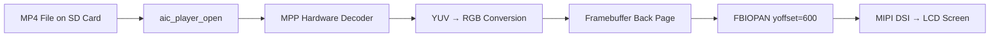
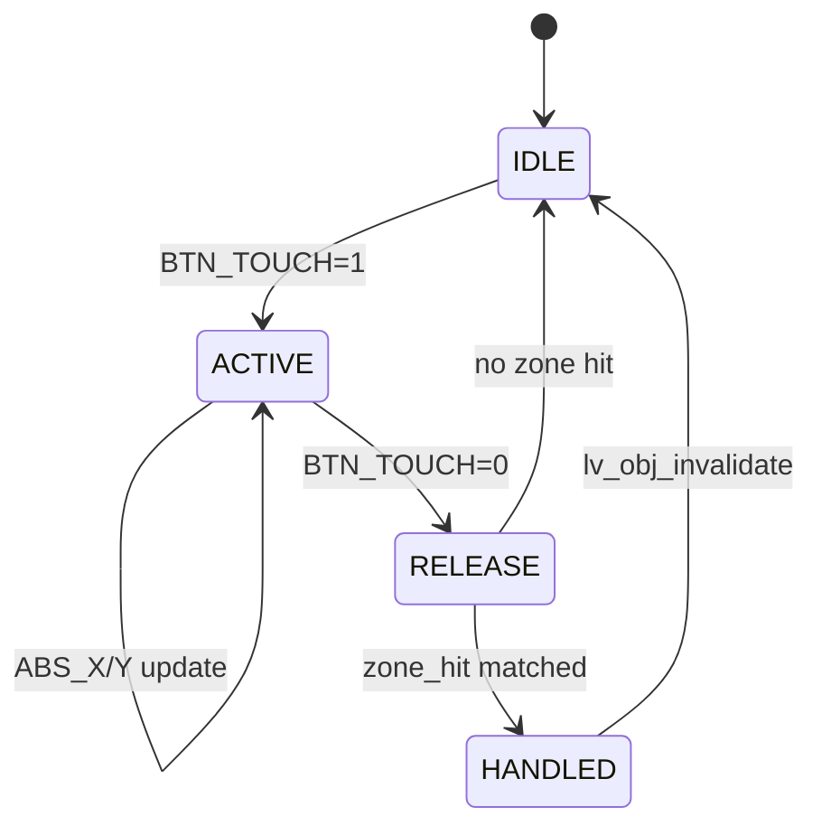

# D213 Dashboard — 演示素材制作方案

## 1. GIF 分镜脚本（15-20 秒）

| 时间 | 画面内容 | 操作动作 | 拍摄建议 |
|------|---------|---------|---------|
| 0s-3s | 冷启动：黑屏 → U-Boot 日志滚动 → LVGL 启动画面 | 上电开机 | 固定机位正面拍摄，录屏 |
| 3s-7s | Mode 0 仪表盘：4 表盘扫表动画 + 指针归位 | 无操作，自动自检 | 展示 2.4s 自检动画 |
| 7s-10s | 模式切换：右滑 → Mode 1 音乐界面 → 点击播放 | 触摸右滑切到音频模式 | 俯拍手指操作+屏幕 |
| 10s-13s | 音频播放：进度条走动 + 时间数字变化 | 点 PLAY 按钮 | 展示播放进度和状态行 |
| 13s-16s | 视频播放：Mode 2 MP4 解码画面 → 底部触摸退出 | 点视频列表 + 视频播放 + 底部滑出 | 展示 FBIOPAN 翻转 |
| 16s-18s | Mode 3 WiFi 面板：SSID/IP/信号强度 | 切到 WiFi 模式 | 展示联网状态 |
| 18s-20s | 快速切回 Mode 0 + 项目 Logo 浮现 | 左滑回到仪表盘 | 展示响应速度 |

### 录制命令

```bash
# 用 ffmpeg 录屏（板端通过 HDMI 采集卡）
ffmpeg -f v4l2 -input_format mjpeg -video_size 1024x600 -i /dev/video0 -t 20 demo.mp4

# 转 GIF（720p，控制文件大小 < 5MB）
ffmpeg -i demo.mp4 -vf "fps=10,scale=720:-1:flags=lanczos,split[s0][s1];[s0]palettegen[p];[s1][p]paletteuse" -loop 0 demo.gif
```

## 2. 架构图 Mermaid 代码

### 软件分层架构

```mermaid
graph TB
    subgraph "UI Layer"
        A[LVGL v8 Rendering Engine]
        A1[dashboard.c - 4 Mode Renderer]
        A2[post_draw_cb - Custom Drawing]
    end

    subgraph "Display Layer"
        B[/dev/fb0 - Framebuffer]
        B1[1024×600 BGRA8888]
        B2[Virtual 1024×1200 Double Buffer]
    end

    subgraph "Media Layer"
        C1[MPP Hardware Decoder]
        C2[ALSA PCM Audio]
    end

    subgraph "Driver Layer"
        D1[aic-mpp / aic_player]
        D2[gt9xx Touch Driver]
        D3[rt2800usb WiFi]
        D4[snd-usb-audio]
    end

    subgraph "Hardware"
        E1[ArtInChip D211 RISC-V]
        E2[128MB DDR3]
        E3[1024x600 LCD + GT9xx]
    end

    A --> B
    A --> C1
    A --> C2
    B --> B1
    B --> B2
    C1 --> D1
    C2 --> D4
    D1 --> E1
    D2 --> E1
    D3 --> E1
    E1 --> E2
    E1 --> E3
```

### 视频数据流



### 控制流



## 3. GitHub 徽章

```markdown
[]()
[]()
[]()
[]()
[]()
[]()
```

## 4. 项目简介（100 字）

**中文**：
> 基于匠芯创 D211 RISC-V SoC（600MHz/128MB）的全栈嵌入式汽车仪表盘系统。C 语言实现，LVGL v8 驱动 UI，MPP 硬件解码 720p 视频，ALSA 音频播放，FBIOPAN 双缓冲显示。4 种仪表盘模式，触摸手势交互，FIFO 远程控制。二进制仅 503KB，运行时内存 4MB，72 小时稳定运行。

**English**:
> A full-stack embedded automotive dashboard on ArtInChip D211 RISC-V SoC (600MHz/128MB). Pure C with LVGL v8 UI, MPP hardware H.264 decoding at 720p, ALSA audio playback, and FBIOPAN double-buffered display. 4 dashboard modes, touch gesture interaction, FIFO remote control. 503KB binary, 4MB runtime memory, 72-hour stability.

## 5. 社交预览图（Open Graph）设计

- **尺寸**：1280×640
- **布局**：左侧 60% 文字区域 + 右侧 40% 设备照片或渲染图
- **配色**：深色背景 (#0a0e17) + 青色强调 (#00d4aa) + 白色文字
- **文字内容**：
  - 大字标题：D213 Dashboard
  - 副标题：RISC-V Automotive Instrument Cluster
  - 底部标签行：LVGL v8 · MPP H.264 · ALSA · Framebuffer · C 100%
- **右侧图片**：板端实拍 Mode 0 仪表盘界面（4 表盘 + 中央屏亮起状态）或裸板照片
