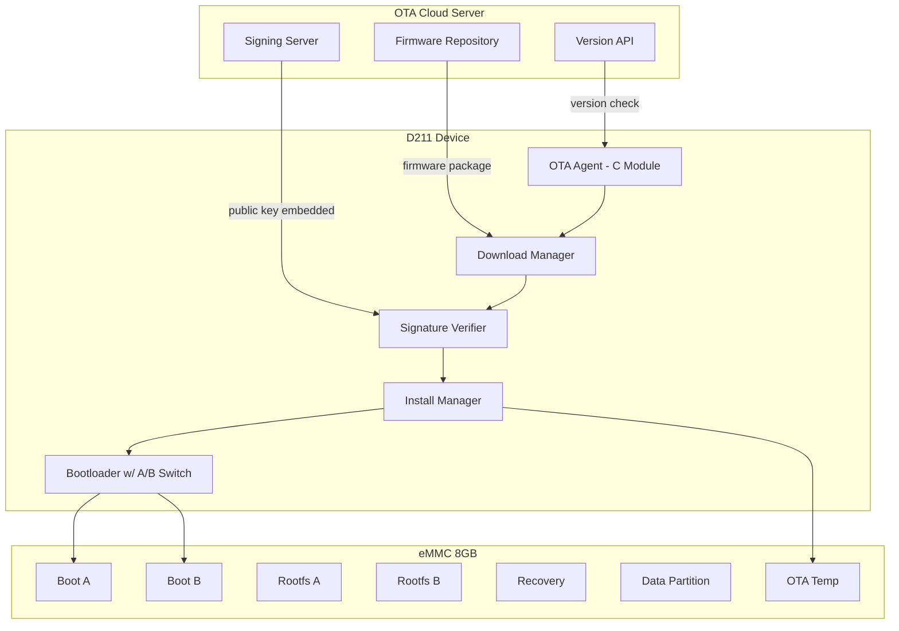
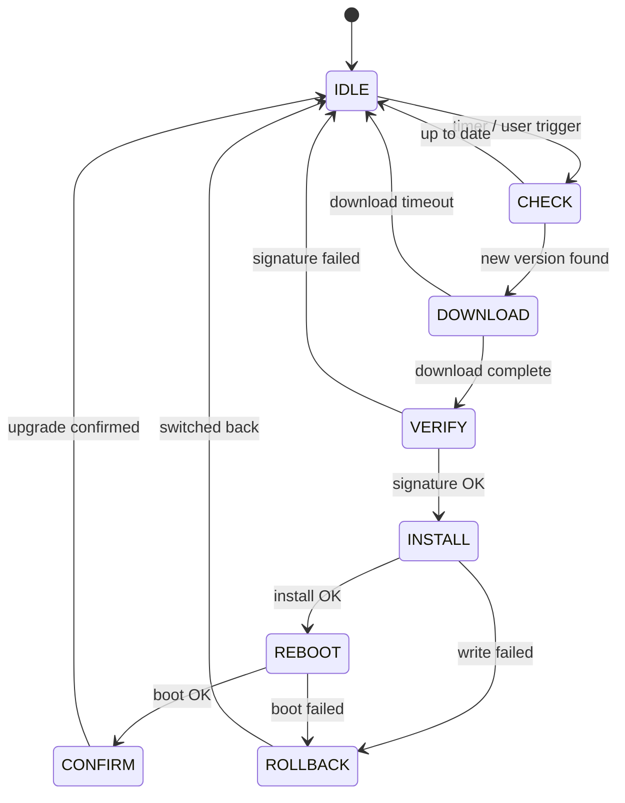

# OTA 固件升级方案

> 项目：d213-dashboard | 平台：ArtInChip D211 RISC-V | 版本：v1.0 | 日期：2026-07

## 1. 系统架构



## 2. 存储分区表

| 分区 | 大小 | 文件系统 | 说明 |
|------|------|---------|------|
| Bootloader | 1MB | raw | U-Boot SPL + U-Boot |
| Kernel A | 8MB | ext4 | 主内核 |
| Kernel B | 8MB | ext4 | 备用内核 |
| Rootfs A | 128MB | squashfs | 主文件系统 |
| Rootfs B | 128MB | squashfs | 备用文件系统 |
| Recovery | 64MB | squashfs | 最小恢复系统 |
| Data | 500MB | ext4 | 用户数据/配置 |
| OTA Temp | 256MB | ext4 | 升级包临时存储 |

**A/B 切换**：通过 U-Boot 环境变量控制：

```bash
# 当前启动分区
fw_printenv boot_partition    # → boot_partition=A

# 切换分区
fw_setenv boot_partition B
fw_setenv boot_attempts 0
```

## 3. 升级包格式

```
update_v2.1.0.tar.gz
├── manifest.json        # 元数据
├── kernel.img           # 内核镜像
├── rootfs.squashfs      # 文件系统镜像
└── pre_install.sh       # 安装前检查脚本
```

**manifest.json**：

```json
{
  "version": "2.1.0",
  "target_device": "d213-dashboard",
  "min_hardware_rev": "1.0",
  "components": {
    "kernel": {
      "file": "kernel.img",
      "size": 8388608,
      "sha256": "a1b2c3d4..."
    },
    "rootfs": {
      "file": "rootfs.squashfs",
      "size": 134217728,
      "sha256": "e5f6a7b8..."
    }
  },
  "signature": "RSA-SHA256:MEUCIQD...",
  "security_version": 3,
  "timestamp": "2026-07-16T10:00:00Z"
}
```

## 4. 安全机制

### 4.1 签名验证

```c
// ota_verify.c — 公钥验签
#include <openssl/rsa.h>
#include <openssl/sha.h>

static const uint8_t PUBLIC_KEY[] = {
    // RSA-2048 公钥（编译时嵌入，不可更改）
    0x30, 0x82, 0x01, 0x0a, /* ... */
};

int ota_verify_signature(const uint8_t *data, size_t len,
                         const uint8_t *sig, size_t sig_len) {
    SHA256_CTX ctx;
    uint8_t hash[SHA256_DIGEST_LENGTH];
    SHA256_Init(&ctx);
    SHA256_Update(&ctx, data, len);
    SHA256_Final(hash, &ctx);

    RSA *rsa = d2i_RSAPublicKey(NULL, &PUBLIC_KEY, sizeof(PUBLIC_KEY));
    if (!rsa) return -1;

    int ret = RSA_verify(NID_sha256, hash, sizeof(hash),
                         sig, sig_len, rsa);
    RSA_free(rsa);
    return (ret == 1) ? 0 : -1;
}
```

### 4.2 A/B 回滚

```c
// Bootloader 端逻辑（C 伪代码）
void boot_check_and_switch(void) {
    int attempts = env_get_int("boot_attempts", 0);
    int max_attempts = env_get_int("boot_max_attempts", 3);

    if (attempts >= max_attempts) {
        // 启动失败次数过多，回滚
        char *other = (env_get("boot_partition")[0] == 'A') ? "B" : "A";
        env_set("boot_partition", other);
        env_set("boot_attempts", "0");
        printf("[BOOT] Too many failures, rolling back to partition %s\n", other);
        reboot();
    }

    env_set_int("boot_attempts", attempts + 1);
    boot_kernel_from_partition(env_get("boot_partition"));
}

// 应用端确认启动成功
void ota_confirm_boot(void) {
    env_set("boot_attempts", "0");
    printf("[OTA] Boot confirmed, partition is stable\n");
}
```

### 4.3 断电保护

```
升级流程采用"先写临时区 → 原子切换"：
1. 下载固件到 OTA Temp 分区
2. 校验 SHA256 + RSA 签名
3. 写入目标分区（B 分区，不碰当前运行的 A）
4. 设置 U-Boot 环境变量 boot_partition=B
5. 重启 → 启动 B 分区
6. 如果 B 启动成功 → ota_confirm() → 标记 A 为"可覆盖"
7. 如果 B 启动失败 → bootloader 自动切回 A
```

任何一步断电，最多就是 OTA Temp 区有垃圾文件，不会破坏运行的 A 分区。

### 4.4 防回滚

```c
// 设备端维护单调递增的安全版本号
static uint32_t device_security_version = 0;

int ota_check_anti_rollback(uint32_t fw_security_version) {
    if (fw_security_version < device_security_version) {
        printf("[OTA] Rollback detected! FW ver=%u, Device ver=%u\n",
               fw_security_version, device_security_version);
        return -1;  // 拒绝升级
    }
    return 0;
}
```

## 5. 升级状态机



## 6. 核心代码框架

```c
// ota_agent.h
#ifndef OTA_AGENT_H
#define OTA_AGENT_H

typedef enum {
    OTA_STATE_IDLE,
    OTA_STATE_CHECK,
    OTA_STATE_DOWNLOAD,
    OTA_STATE_VERIFY,
    OTA_STATE_INSTALL,
    OTA_STATE_REBOOT,
    OTA_STATE_CONFIRM,
    OTA_STATE_ROLLBACK,
} ota_state_t;

typedef struct {
    ota_state_t state;
    char version[32];
    char server_url[256];
    int progress_pct;
    int error_code;
    uint32_t security_version;
} ota_ctx_t;

int ota_init(ota_ctx_t *ctx, const char *server_url);
int ota_check_update(ota_ctx_t *ctx, char *new_version);
int ota_download(ota_ctx_t *ctx, const char *url);
int ota_verify(ota_ctx_t *ctx);
int ota_install(ota_ctx_t *ctx);
int ota_confirm(ota_ctx_t *ctx);
int ota_rollback(ota_ctx_t *ctx);

#endif /* OTA_AGENT_H */
```

## 7. 与仪表盘集成

```c
// 在 Mode 0 仪表盘的 post_draw_cb 中添加 OTA 进度
if (ota_ctx.state == OTA_STATE_DOWNLOAD) {
    char buf[32];
    snprintf(buf, sizeof(buf), "正在升级 %d%%", ota_ctx.progress_pct);
    lv_draw_label(dc, &label_dsc, &area, buf, NULL);
}

// 升级期间保持车速/转速显示不中断（降级策略）
// Mode 0 表盘不受影响，只在状态行显示升级进度
```

## 8. 测试验证

| 测试项 | 方法 | 预期结果 |
|--------|------|---------|
| 正常升级 | 推送新版本 → 设备自动下载安装 → 重启 | 新版本正常运行 |
| 断电恢复 | 下载到 50% 断电 → 重新上电 | 从 OTA Temp 恢复，不丢数据 |
| 签名篡改 | 修改 manifest.json 后推送 | 设备拒绝安装 |
| 版本回滚 | 推送旧版本固件 | security_version 检查拒绝 |
| 空间不足 | 填满 OTA Temp 分区后推送 | 返回错误码，不清除现有固件 |

## 9. 风险分析

| 风险 | 影响 | 缓解措施 |
|------|------|---------|
| OTA 服务器宕机 | 无法更新 | 多 CDN 备份、离线升级（USB）作为备选 |
| 签名私钥泄露 | 恶意固件 | 私钥离线存储，定期轮换 |
| eMMC 坏块 | 升级失败 | 坏块管理，写入后校验 |
| 网络不稳定 | 下载中断 | 断点续传（HTTP Range 请求） |

## TODO

- [ ] 实现 HTTP Range 断点续传
- [ ] 集成 LVGL UI 升级进度条
- [ ] 添加升级日志持久化（写入 Data 分区）
- [ ] 支持差分升级（delta update）以减少下载量
